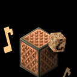

 

## Projects

<table>
  <tr>
    <td width="48" valign="top">
      
    </td>
    <td valign="top">
      <a href="https://github.com/polang233/GoodsTrade"><b>GoodsTrade</b></a> 
      简单安全的玩家物品交易插件
    </td>
    <td width="48" valign="top">
      
    </td>
    <td valign="top">
      <a href="https://github.com/polang233/NoTime"><b>NoTime</b></a> 
      轻量时间管理与定时任务
    </td>
  </tr>
  <tr>
    <td width="48" valign="top">
      
    </td>
    <td valign="top">
      <a href="https://github.com/polang233/HeadSound"><b>HeadSound</b></a> 
      可交互头颅与音符盒音效
    </td>
    <td width="48" valign="top">
      
    </td>
    <td valign="top">
      <a href="https://github.com/polang233/TracesDeath"><b>TracesDeath</b></a> 
      轻量遗体与墓碑，原槽位取回物品
    </td>
  </tr>
  <tr>
    <td width="48" valign="top">
      
    </td>
    <td valign="top">
      <a href="https://github.com/polang233/VelocityToolbox"><b>VelocityToolbox</b></a> 
      Velocity 热管理、资源包下发与版本限制
    </td>
    <td width="48" valign="top">
      
    </td>
    <td valign="top">
      <a href="https://github.com/polang233/display-anim-preview"><b>display-anim-preview</b></a> 
      Blockbench 插件：预览并导出物品动画
    </td>
  </tr>
  <tr>
    <td width="48" valign="top">
      
    </td>
    <td valign="top">
      <a href="https://github.com/polang233/cursor-language-pack"><b>Cursor Language Pack</b></a> 
      Cursor IDE 中文语言包
    </td>
    <td width="48" valign="top">
      
    </td>
    <td valign="top">
      <a href="https://github.com/polang233/kiro-language-pack"><b>Kiro Language Pack</b></a> 
      Kiro IDE 中文语言包
    </td>
  </tr>
</table>
